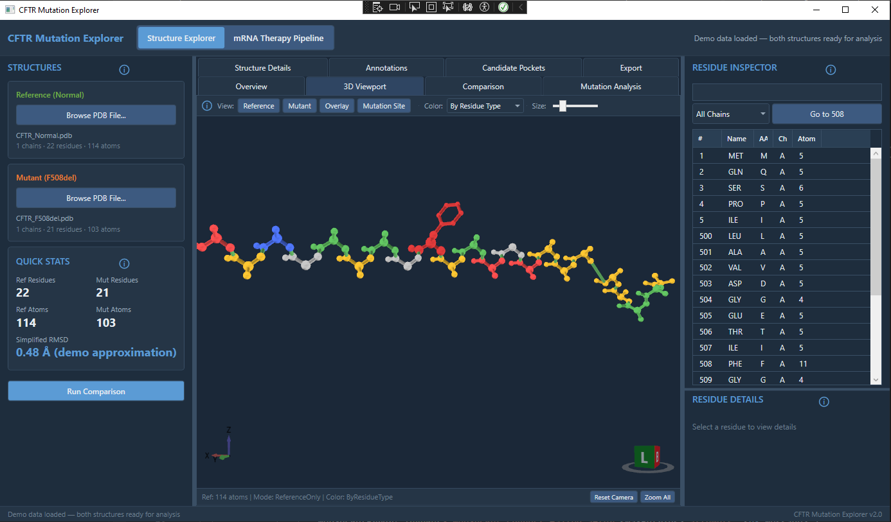

# CFTR Mutation Explorer

A WPF desktop application prototype for exploring how mutations in the CFTR protein may affect structure and function in cystic fibrosis research workflows. It allows researchers to load protein structure files, inspect mutation regions, compare reference and mutant structures, add annotations, and export analysis summaries.

The application is intended as a scientific desktop software demo emphasizing WPF, MVVM, parsing, visualization, and research-oriented UX.

## Key Features

- **mRNA Therapy Pipeline** — Two-stage mRNA design: Stage 1 (NSGA-II codon optimizer via Python FastAPI service) and Stage 2 (Phase 5 rescoring with ViennaRNA folding, 12 metrics, diversity filter). Requires Python service at `scripts/mrna_service`.
- **PDB File Loading** — Parse and display protein structures from standard .pdb files with async loading, progress reporting, and cancellation support
- **3D Protein Visualization** — Interactive 3D viewport using HelixToolkit.Wpf with rotate/pan/zoom, multiple view modes (reference, mutant, overlay, mutation highlight), and color schemes (by chain, residue type, B-factor)
- **Structure Comparison** — Side-by-side comparison of reference and mutant structures with residue-by-residue analysis, simplified RMSD calculation, and missing residue detection
- **ΔF508 Mutation Analysis** — Dedicated analysis of the phenylalanine-508 deletion including neighborhood inspection, folding impact assessment, and structural deviation metrics
- **Annotations** — Create, save, and manage annotations linked to specific residues or regions, persisted in SQLite
- **Binding Pocket Detection** — Heuristic-based candidate pocket identification using spatial clustering of binding-relevant residues (demo screening aid)
- **Export** — Generate Markdown comparison reports, CSV annotation exports, and viewport screenshots

## Architecture

```
CftrMutationExplorer.sln
├── src/
│   ├── CftrMutationExplorer.Core        # Domain models, interfaces
│   ├── CftrMutationExplorer.Infrastructure  # PDB parser, SQLite, services
│   └── CftrMutationExplorer.App         # WPF UI, ViewModels, Views
├── tests/
│   └── CftrMutationExplorer.Tests       # xUnit tests
└── data/                                # Sample PDB files
```

### Design Principles

- **MVVM** throughout — ViewModels use CommunityToolkit.Mvvm with `[ObservableProperty]` and `[RelayCommand]`
- **Dependency Injection** — Services registered via `Microsoft.Extensions.DependencyInjection`
- **Interface Segregation** — All services behind interfaces (`IPdbParser`, `IStructureComparisonService`, `IAnnotationRepository`, etc.)
- **Separation of Concerns** — Domain models in Core, parsing/persistence in Infrastructure, UI in App
- **Async/Await** — File loading, database operations, and exports are async with cancellation token support

## Technology Stack

| Component | Technology |
|-----------|-----------|
| Framework | .NET 8, WPF |
| MVVM | CommunityToolkit.Mvvm 8.4 |
| 3D Rendering | HelixToolkit.Wpf 3.1 |
| Database | SQLite via Microsoft.Data.Sqlite |
| DI | Microsoft.Extensions.DependencyInjection |
| Testing | xUnit |

## How to Run

### Prerequisites
- .NET 8 SDK
- Windows (WPF requirement)

### Build and Run
```bash
dotnet restore
dotnet build
dotnet run --project src/CftrMutationExplorer.App
```

### mRNA Therapy Pipeline (optional)
The mRNA Therapy tab requires a Python FastAPI service. From the repo root:
```bash
cd scripts/mrna_service
pip install -r requirements.txt
uvicorn main:app --host 127.0.0.1 --port 8787
```
Then launch the WPF app and use the **mRNA Therapy Pipeline** tab. Stage 1 runs codon optimization; Stage 2 (Phase 5) rescores top candidates with ViennaRNA folding.

### Run Tests
```bash
dotnet test
```

### Quick Start
1. Launch the application
2. Click **Load Demo Data** in the toolbar to load sample CFTR structures
3. The 3D viewport will render the reference structure
4. Switch between tabs to explore comparison, mutation analysis, and annotations
5. Use the right panel to search and inspect individual residues

## Domain Model

| Entity | Description |
|--------|-------------|
| `ProteinStructure` | Top-level container for a parsed PDB file |
| `Chain` | A polypeptide chain (e.g., Chain A) |
| `Residue` | An amino acid residue with atoms and centroid |
| `Atom` | Individual atom with 3D coordinates and properties |
| `Annotation` | User-created note linked to a residue/region |
| `StructureComparisonResult` | Comparison metrics between two structures |
| `BindingPocketCandidate` | Heuristic-detected potential drug binding site |
| `AnalysisSession` | Persisted analysis state |

## Service Interfaces

| Interface | Purpose |
|-----------|---------|
| `IPdbParser` | Parse .pdb files into domain models |
| `IStructureComparisonService` | Compare structures, calculate RMSD, find neighborhoods |
| `IAnnotationRepository` | CRUD operations for annotations (SQLite) |
| `ISessionPersistenceService` | Save/load analysis sessions |
| `IReportExportService` | Export reports (Markdown), annotations (CSV), screenshots (PNG) |
| `IBindingPocketService` | Detect candidate binding pockets via heuristic |

## Scientific Disclaimers

- The simplified RMSD calculation pairs alpha-carbon atoms by residue sequence number without structural alignment (Kabsch algorithm). Values are labeled as "demo approximation."
- Binding pocket detection uses spatial clustering of binding-relevant residues. It is a screening aid, not a validated drug docking algorithm.
- Sample PDB data is synthetic demo data, not from real crystallography experiments.

## Screenshots



## Test Coverage

- PDB parser: header/title parsing, atom coordinates, residue grouping, multi-chain, HETATM, empty files, malformed lines, cancellation, progress reporting
- Structure comparison: identical structure RMSD, missing residues, shifted structure RMSD, neighborhood detection, chain differences
- Annotation repository: CRUD operations, residue filtering
